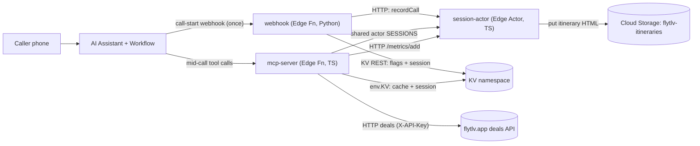

# FlyTLV Travel Line — Live Walkthrough & Decision Review (deck)

Slide text for the 7–10 minute "Live Walkthrough & Decision Review" defined in
[docs/challenge/code_challenge.md](../challenge/code_challenge.md) (Demo Day,
part 2). Audience: the Telnyx FDE team. The live demo itself follows
[DEMO_SCRIPT.md](DEMO_SCRIPT.md) and is not part of this deck.

Every fact below comes from the repository. No number, cost, model name or bug
detail is invented; where a fact was missing I wrote `TODO(Yaniv): …`.

## Slide 1 - FlyTLV Travel Line

- Cheap flights from Tel Aviv by phone, round trip or one way.
- Phone: **+972765671113** — bought and linked; regulatory approval pending.
- Webhook: https://fde-webhook-e5907143-e.telnyxcompute.com
- MCP server: https://fde-mcp-bc3393fa-a.telnyxcompute.com
- Session actor: https://fde-session-actor-94b99eb9-4.telnyxcompute.com

Notes:
A caller dials the line, asks for cheap flights from Tel Aviv, hears the best
deals from the live flytlv.app feed, can save one, and on the next call hears
"welcome back, last time you saved Larnaca, 64 dollars." The phone number is
bought and linked but Telnyx regulatory approval is still pending, so the live
demo may use the Portal call tester. Three Edge services are live: the webhook,
the MCP server, and the session actor.

## Slide 2 - Why this use case

- Real problem: Tel Aviv flight prices change constantly; hard to search.
- Callers: people in Israel who prefer a quick call to browsing.
- Frequent Tel Aviv delays and cancellations make urgency real.
- Builds on the existing flytlv.app deals feed and data.
- Touches every required primitive: workflow, MCP, webhook, KV, actor.

Notes:
Tel Aviv flight prices move fast and there are frequent delays and
cancellations, so a thirty-second call beats browsing. The callers are people
in Israel who would rather speak than search the web. It also reuses my own
flytlv.app deals data and exercises every primitive the challenge requires. A
real problem, not a toy.

## Slide 3 - Architecture

Notes:
At call start the workflow fires the webhook once, which reads flags from KV
and records the call on the caller's actor. Mid-conversation, the prompt tool
nodes call the MCP server, which reads the KV cache, calls flytlv, and reaches
the same caller actor directly through the shared SESSIONS binding. The Python
webhook cannot bind actors, so it uses the HTTP facade; the TypeScript MCP
server skips that hop.

## Slide 4 - Conversation Workflow

- 12 nodes: 4 speak, 7 prompt, 1 tool.
- Speak nodes: greeting, degraded, deals-disabled, farewell — verbatim.
- Prompt nodes: identify, search, save, list, FAQ, escalate, transfer.
- Tool node: hangup_call — deterministic end, shared hangup tool.
- Speak = verbatim/compliance; prompt = LLM step; tool = no model turn.

Notes:
Speak nodes deliver the brand greeting and the three notices word-for-word
with no model turn — the disclosure must not be paraphrased. Prompt nodes are
every LLM-driven step: the routing hub, search, save, list, FAQ, escalation
and transfer. The End Call node is a terminal tool node running a shared
hangup tool, so no prompt node can hang up mid-conversation. In tests and dry
runs the hangup node falls back to a prompt.

## Slide 5 - Edges

- 26 edges: 3 expression, 4 default, 19 LLM.
- Expression edges: backend_degraded, flag_deals_enabled, duration >= 600.
- Expression = deterministic facts, evaluated before the model turn.
- LLM edges: intent routing — caller phrasing varies, needs judgement.
- Default edges: every speak node's one required single edge.

Notes:
Expression edges are deterministic facts that must never depend on model
judgement, so they are evaluated before the model turn — a degraded backend
routes to a scripted notice automatically. LLM edges handle intent, where the
caller's words vary. Every speak node has exactly one default edge, which
validate() enforces. Declaration order is priority order, so expression edges
win over LLM edges at the identify_intent hub.

## Slide 6 - MCP server

- Four tools: search_deals, save_deal, list_saved_deals, send_deal_sms.
- search→setLastResults; save→saveDeal; list→getSaved; sms→saveDeal + getSaved.
- Tools are assistant-level; each node's text names its one tool.
- Official @modelcontextprotocol/sdk; stateless transport per request.
- Bearer MCP_API_KEY checked before the transport; ToolError → isError:true.

Notes:
MCP tools cannot be scoped per workflow node — only shared tools can — so all
four are visible at every prompt node, and each node's instructions name the
one to call; the server enforces safety itself. We use the official SDK with a
fresh stateless StreamableHTTPServerTransport per request, since Edge has no
request lifespan. Tool failures return isError:true with a caller-friendly
message, never a traceback or URL. The conversation id arrives in
params._meta.telnyx_conversation_id.

## Slide 7 - Dynamic Webhook Variables

- Returns: caller_known, call_count, saved_count, last_saved_deal.
- Plus backend_degraded and flag_<name> (deals_enabled, sms, promo).
- Greeting: "welcome back, last time you saved Larnaca, 64 dollars".
- Routes: backend_degraded → degraded_notice; flag off → deals_disabled.
- 1.5 s platform default; assistant sets 8000 ms; internal budget 2500 ms.

Notes:
The webhook overrides the assistant's default variables at call start; if it
fails entirely the defaults keep expression edges from comparing against raw
placeholders. The 1.5 second platform default is too tight for a cold Edge
start, so the assistant timeout is 8000 ms and the webhook keeps an internal
2500 ms parallel budget — the session write even runs after the response. On
any actor or KV failure it returns backend_degraded=true, which routes the
call to a scripted notice instead of reading placeholders on air.

## Slide 8 - Actor vs KV vs plain function logic

| State | Primitive | Reason |
| --- | --- | --- |
| Feature flags (toggle paths) | **KV** `flags/assistant` | Read-mostly, operator-set; eventual consistency is fine. |
| Cached flytlv deal searches | **KV** + `ttl_secs` `cache/deals/<sig>` | Avoid repeat upstream calls; stale-for-seconds is ok. |
| Conversation → caller map | **KV** + `ttl_secs` `session/<conv>` | Written once by webhook, read-only by MCP; not an LLM arg (security). |
| Per-caller count / results / saved | **Stateful Actor** (one per caller) | Atomic read-modify-write; KV has no CAS, so concurrent calls lose updates. |
| Per-request data (auth, slimmed deals, trace) | **Plain function logic** | Lives for one request; nothing to persist. |
| Service counters + latency | **MetricsCounter Actor** | Edge scales to zero; KV loses concurrent increments. |
| Itinerary HTML page | **Cloud Storage** `flytlv-itineraries` | Served at GET /itineraries/<uuid>.html; runtime has no signed URLs. |
| Pending reminder + alarm | **Actor storage + alarm** | One alarm per caller; sender captured so alarm() needs no process.env. |

Notes:
The rule is: pick the cheapest primitive that is correct. KV wins for
read-mostly flags, caches and the one-write session map. The actor wins for
per-caller read-modify-write — proven by 20 concurrent recordCalls returning
counts 1..20 with none lost. The itinerary lives in Cloud Storage because it
is a file to serve, and the reminder lives in actor storage because the alarm
is per actor instance.

## Slide 9 - Stretch goals done

- Actor alarms: follow-up SMS reminder via setAlarm (one per caller).
- Cloud Storage: itinerary HTML in the flytlv-itineraries bucket.
- KV feature flags: deals_enabled, sms_enabled, promo — no redeploy.
- Shared actors: MCP binds CallerSession directly via SESSIONS, no HTTP hop.
- Distributed tracing: one trace_id across all three services.

Notes:
Only the stretch goals the code really ships. Variable-comparison edges also
land here: the three expression edges route on duration, the deals flag and
the degraded flag, all evaluated before the model. Not done: multi-assistant
routing — we have a transfer-to-human tool, not a second assistant persona.
The custom dynamic-variables webhook is a core requirement, so I do not count
it as a stretch.

## Slide 10 - Observability

- JSON log line per event; one latency span per request (duration_ms).
- MetricsCounter actor: counters + latency; `scripts/ops/metrics.py` snapshot.
- Platform metrics: `telnyx-edge metrics <fn>` — 2xx/4xx/5xx, p95.
- trace_id = conversation id, across webhook, actor and MCP.
- The webhook is the canary — every call hits it first.

Notes:
Within a minute I look at `telnyx-edge metrics fde-webhook` first: rising
4xx/5xx or p95 toward the timeout is the first sign a call is broken. Then I
filter logs for outcome != ok — rejected means a signature problem, degraded
means KV or the actor is down, and the degraded array names which dependency.
Finally I follow one trace_id into the other two services to reconstruct the
whole call. backend_degraded also flows back to the assistant, so a broken
backend is partly self-protecting.

## Slide 11 - The hardest bug

- Symptom: itinerary URL and reminder never appeared on a save.
- Signal: log `itinerary_skipped reason=noITINERARY_BASE_URL` on every save.
- Root cause: umbrella telnyx.toml [env_vars] miss actor process.env.
- Fix: MCP forwards config on saveDeal; actor reads `config ?? process.env`.
- Evidence: itineraryUrl now returns; reminder_scheduled fires; check passes.

Notes:
The value was set in the actor's umbrella telnyx.toml, but the logs proved the
actor instance never saw it — while the Cloud Storage bucket binding did, and
the MCP function's own env did. So the MCP server now forwards the four values
on every saveDeal call and the actor resolves config first, with process.env
as a fallback. I also captured the SMS sender into the pending reminder so the
alarm turn does not depend on process.env either. A check_itinerary.mts case
with no process.env proves the passed config works end to end.

## Slide 12 - Building with Telnyx Inference via OpenCode

- Built with GLM-5.2; the webhook v1 on Kimi-K3.
- Assistant talks on zai-org/GLM-5.3-Flash on Telnyx Inference.
- Worked: test-first prompts passed the tests in few iterations.
- Hard: credit stops (error 20015); token cost from global context.
- Edge gaps surfaced only on deploy: Python 3.9, /health probes.

Notes:
Test-first prompts against the acceptance tests plus the short rules file
produced passing code in a few iterations, and GLM-5.2 handled multi-file work
well, including the MCP port from Python to TypeScript. What hurt: a negative
balance stops inference mid-step with error 20015, so two steps were rerun,
and global context blew tokens to 215k until a clean config dir cut it to 8.7k.
Platform specifics like the 3.9 build and the health probes only appeared on
deploy and were fixed from logs, not from the model.

## Slide 13 - Tradeoffs and what I would do next

- Expression vs LLM edges: facts deterministic, intent flexible.
- Actor for read-modify-write (20 concurrent, none lost); KV for reads.
- Shared actor skips HTTP; facade stays for Python and for metrics.
- One alarm per caller — last save wins, not a reminder per deal.
- Next: link the human transfer; flight status; per-deal reminders.

Notes:
I chose expression edges for deterministic facts so a degraded backend never
depends on the model noticing it, at the cost of less flexible routing. The
actor wins for read-modify-write and KV wins for read-mostly caches and flags;
MetricsCounter would shard by hour if throughput grows. The one-alarm-per-actor
limit means a newer save replaces the reminder, so today there is one reminder
per caller, not per deal. Next I would link the human transfer number, add a
flight-status branch, and move reminders to a CronTick actor for per-deal
scheduling.

## Sources

Per slide, the files the facts come from:

- **Slide 1 (Title):** README.md (phone + status, live endpoints), AGENTS.md
  (registered func ids), services/webhook/func.toml, services/mcp-server/func.toml,
  services/session-actor/telnyx.toml.
- **Slide 2 (Why this use case):** docs/challenge/USE_CASE.md,
  docs/design/DECISIONS.md (#10), README.md.
- **Slide 3 (Architecture):** docs/design/ARCHITECTURE.md, README.md,
  services/webhook/function/func.py, services/mcp-server/func.toml,
  services/mcp-server/src/actor.ts, services/session-actor/telnyx.toml,
  services/session-actor/src/index.ts.
- **Slide 4 (Conversation Workflow):** assistant/flow.py (`build_flow`,
  `_NODE_IDS`), README.md.
- **Slide 5 (Edges):** assistant/flow.py (`build_flow`, `validate`,
  `_expr_eq`, `_expr_gte`, `_llm`, `_default`), README.md.
- **Slide 6 (MCP server):** services/mcp-server/src/server.ts
  (`createServer`, `createHandler`, tool registrations, `slim`),
  services/mcp-server/src/actor.ts (`EdgeActor`, `ActorClient`),
  services/mcp-server/func.toml, README.md, docs/design/DECISIONS.md (#13).
- **Slide 7 (Dynamic Webhook Variables):** services/webhook/function/func.py
  (`_dynamic_variables`, `_fetch_context`, `_save_session`, `_flags`),
  assistant/flow.py (`DEFAULT_VARIABLES`), assistant/provision.py
  (`WEBHOOK_TIMEOUT_MS`), docs/design/DECISIONS.md (#6, #19, #20),
  docs/challenge/code_challenge.md (1.5 s default), AGENTS.md.
- **Slide 8 (Actor vs KV vs plain function):** README.md, docs/design/
  ARCHITECTURE.md, docs/design/DECISIONS.md (#9, #11, #13, #21, #30, #31),
  shared/common.py (`Kv`, `ActorClient`, `save_session`), services/session-actor/
  src/caller-session.ts (`CallerSession`), scripts/ops/live_check.py
  (20 concurrent recordCalls), services/session-actor/src/index.ts
  (`serveItinerary`).
- **Slide 9 (Stretch goals done):** services/session-actor/src/caller-session.ts
  (`alarm`, `_writeItineraryAndScheduleReminder`), services/session-actor/telnyx.toml
  (`[storage.cloudstorage.ITINERARIES]`), services/mcp-server/func.toml
  (`[[actors]] SESSIONS`, `[env_vars]` flags), services/mcp-server/src/actor.ts
  (`EdgeActor`), README.md, docs/challenge/code_challenge.md (stretch list).
- **Slide 10 (Observability):** docs/design/OBSERVABILITY.md, README.md
  ("How I'd know within a minute"), scripts/ops/metrics.py, shared/common.py
  (`logger`, `timed`, `set_trace_id`), services/session-actor/src/index.ts
  (`actor.request` span), services/mcp-server/src/server.ts (`mcp.request` span).
- **Slide 11 (Hardest bug):** docs/design/DECISIONS.md (#28, #29),
  docs/build/DOGFOODING.md ("The live bug"), services/session-actor/telnyx.toml
  (live-finding comment), services/mcp-server/src/server.ts (`saveDealConfig`,
  `saveDealBody`), services/session-actor/src/caller-session.ts (`saveDeal`,
  `pickString`, `pickPositiveNumber`, `alarm`), tests/README.md
  (`check_itinerary.mts`), README.md.
- **Slide 12 (Building with Telnyx Inference via OpenCode):** docs/build/PROMPTS.md
  (status + model list), docs/build/DOGFOODING.md, README.md (status table,
  "Tool comparison", OpenCode config), docs/design/DECISIONS.md (#15, #27).
- **Slide 13 (Tradeoffs and next):** docs/design/DECISIONS.md (#12, #9, #21,
  #31, #32; "Pending decisions"), README.md, docs/challenge/code_challenge.md
  (stretch goals), assistant/flow.py (`instructions_mode` append/replace).
